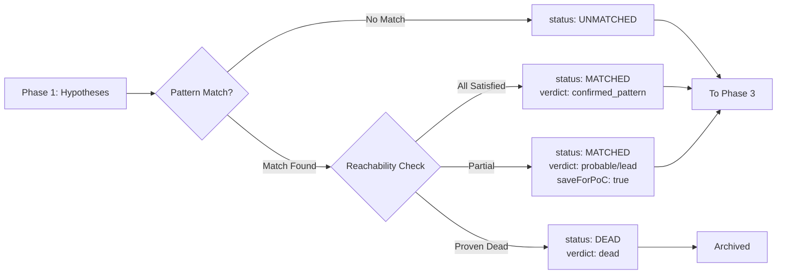

# Phase 2: Pattern Matching

> **Part of**: [RedTeam Trackator SKILL.md](../SKILL.md) | **Phase**: 2 of 6 | **Previous**: [Phase 1 - Intent Filtering](phase-1-intent-filtering.md) | **Next**: [Phase 3 - Creative Attack](phase-3-creative-attack.md)

---

## Objective

Cross-reference surviving hypotheses against historical exploit pattern cards to find matches and assess reachability.

---

## Plugin: Pattern Matcher Plugin

**Purpose**: Match current alerts against known exploit patterns from Exploits-class-library.

**Input**: Exploits-class-library directory structure

### Library Structure

```
Exploits-class-library/
├── card-index.csv                    # All cards with metadata
├── protocol-type-to-exploit-patterns.json  # Protocol type → applicable patterns
└── exploit-pattern-cards/
    ├── reentrancy-state-update-after-external-call.md
    ├── flash-loan-spot-price-manipulation-single-tx.md
    ├── missing-modifier-privileged-function.md
    └── ... (56 total pattern cards)
```

### Pattern Matching Algorithm

```javascript
async function patternMatch(hypothesis, context, exploitsLibPath) {
    const protocolType = context.protocolType;
    const alert = hypothesis.sourceAlert;
    
    // Step 1: Get applicable patterns for this protocol type
    const applicablePatterns = loadPatternsForProtocolType(protocolType, exploitsLibPath);
    
    const matches = [];
    
    for (const pattern of applicablePatterns) {
        const matchScore = calculatePatternMatch(alert, pattern);
        
        if (matchScore > THRESHOLD) {
            matches.push({
                patternSlug: pattern.slug,
                primaryBugClass: pattern.primary_bug_class,
                matchScore: matchScore,
                representativeLoss: pattern.representative_loss_usd,
                detectionHeuristic: pattern.detection_heuristic,
                preconditionChain: pattern.precondition_chain
            });
        }
    }
    
    return matches.length > 0 ? matches : null;
}
```

### Match Scoring Factors

| Factor | Weight | Trackator Mapping |
|--------|--------|-------------------|
| Bug class match (reentrancy ↔ CEI violation) | 30% | `alert.category` ↔ `pattern.primary_bug_class` |
| Protocol type match | 25% | `context.protocolType` ↔ `pattern.protocol_types` |
| Detection heuristic match | 25% | `alert.condition` ↔ `pattern.detection_checklist` |
| Severity alignment | 10% | `alert.severity` ↔ historical loss |
| Prerequisite satisfaction | 10% | `context.entryPoints` ↔ `pattern.prerequisites` |

---

## v2.0 ENHANCED: Additional Scoring Factors (Factors 6-9)

When Trackator's enhanced analysis phases are available, the Pattern Matcher applies **4 additional scoring factors** via `calculateMatchScore_v2()` (see `plugins/pattern-matcher.md`):

| Factor | Weight | Source Data | Description |
|--------|--------|-------------|-------------|
| **Factor 6: Storage Dependency Alignment** | +10% bonus | `context.storage` | Does pattern target value-bearing variables with permissionless writers? |
| **Factor 7: State Coupling Signal** | +10% bonus | `context.coupling` | Does pattern exploit strong couplings between accessible functions? |
| **Factor 8: Synchronization Risk** | +10% bonus | `context.sync` | Is this a timing-based attack supported by desync analysis? |
| **Factor 9: Evidence Validator Pre-Classification** | adjusts confidence | `context.evidence` | Has this finding been pre-validated as confirmed/FP? |

**Maximum possible score with v2.0 bonuses**: 1.0 (base) + 0.35 (bonuses) = **1.35 (capped at 1.0)**

### Key v2.0 Scoring Functions

- `checkStorageAlignment(alert, pattern, storage)` → Returns 0-1 storage alignment score
- `checkCouplingSignal(alert, pattern, coupling)` → Returns 0-1 coupling signal score  
- `checkSyncRisk(alert, pattern, sync)` → Returns 0-1 sync risk score
- `checkPreClassification(alert, evidence)` → Returns {class, criteriaMet} for adjustment

---

## Example: Reentrancy Pattern Match

### Trackator Alert

```json
{
  "id": "ALERT_1",
  "name": "CEI Pattern Violation - Potential Reentrancy",
  "category": "reentrancy",
  "condition": { "type": "pattern", "field": "ceiPattern", "operator": "eq", "value": "violated" },
  "severity": "critical"
}
```

**Matching Exploit Card**: `reentrancy-state-update-after-external-call.md`

### Detection Heuristic from Card

> A function performs `.call{value: x}("")`, `.transfer()`, ERC20 transfer to externally-supplied address, and ONLY AFTER writes to balance/debt/share storage. Function lacks `nonReentrant` modifier.

### Match Result

```javascript
{
    patternSlug: 'reentrancy-state-update-after-external-call',
    primaryBugClass: 'reentrancy',
    matchScore: 0.92,  // High match!
    representativeLoss: 4750000,  // $4.75M from DeltaPrime
    detectionHeuristic: { signature: "...", grepPatterns: [...], checklist: [...] },
    preconditionChain: [
        "External call before state update",
        "No reentrancy guard OR wrong scope",
        "Attacker-controlled callback target",
        "Re-entry reads stale state"
    ]
}
```

---

## Plugin: Reachability Check (BLOCK GATE #1)

**Purpose**: Verify if matched pattern is actually reachable by attacker.

**IMPORTANT**: This is a **BLOCK GATE**, not kill gate!

> 📄 **Full implementation**: See [`references/code-examples.md#reachability-check`](../references/code-examples.md#reachability-check) for complete `reachabilityCheck()` function (~46 lines)

### Reachability Check Logic Summary

The reachability check evaluates each precondition in the matched pattern's precondition chain:

| Verdict | Condition | Action |
|---------|-----------|--------|
| `dead` | All unsatisfied preconditions proven false | Block hypothesis (proven unreachable) |
| `confirmed_pattern` | ALL preconditions satisfied | High confidence, proceed |
| `probable` | More satisfied than unknown | Medium confidence, save for PoC |
| `lead` | More unknown than satisfied | Low confidence lead, save for PoC |

**Key Principle**: Unknown preconditions trigger `saveForPoC: true` — hypotheses are saved, not killed!

### Reachability Checks Using Trackator Data

| Precondition Type | Trackator Fields to Check |
|-------------------|----------------------------|
| External call exists | `functions[].body.hasExternalCall === true` |
| No reentrancy guard | `functions[].modifiers[]` does NOT include `nonReentrant` |
| Attacker-controlled target | `functions[].parameters[]` includes address type, OR calls `msg.sender` |
| Public entry point | `entryPoints[].access === 'anyone'` |
| Value at risk | `assetsAtRisk[]` includes target asset |

---

## Phase 2 Output

After Phase 2 completes, each hypothesis is updated:

```javascript
hypothesis.status = 'MATCHED';  // or DEAD if proven unreachable
hypothesis.patternMatches = [/* array of matches */];
hypothesis.reachabilityResult = {
    verdict: 'confirmed_pattern' | 'probable' | 'lead' | 'dead',
    preconditions: {/* satisfied/unsatisfied/unknown */},
    saveForPoC: boolean
};
```

### Output Status Flow



---

## Cross-References

| Reference | Description |
|-----------|-------------|
| [`plugins/pattern-matcher.md`](../plugins/pattern-matcher.md) | Detailed plugin documentation |
| [`references/code-examples.md`](../references/code-examples.md) | Full code implementations |
| [`Exploits-class-library/`](../Exploits-class-library/) | 56 historical exploit pattern cards |
| Phase 1 | Input: Hypotheses from Hypothesis Generator |
| Phase 3 | Output consumers: Attack Path Construction |

---

*Last extracted from original SKILL.md (lines 655-851)*
