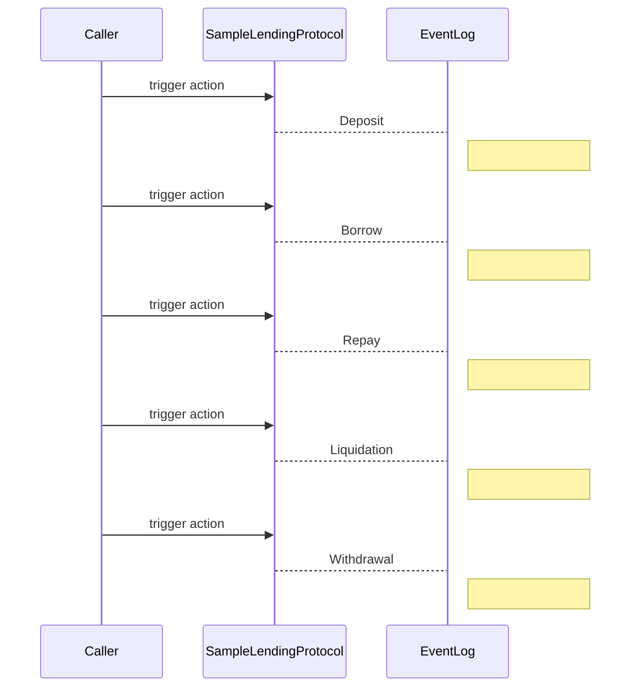
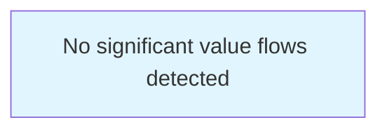

# Trackator Static Analysis Report

**Generated:** 2026-08-06T04:11:53.525Z
**Contracts Analyzed:** 4

## Table of Contents

- [Protocol Overview](#protocol-overview)
- [Contract Details](#contract-details)
- [Function Registry](#function-registry)
- [State Variables](#state-variables)
- [Call Graph](#call-graph)
- [Risk Assessment](#risk-assessment)
- [Mermaid Diagrams](#mermaid-diagrams)

## Protocol Overview

| Contract | Functions | State Vars | Events | Lines |
|----------|-----------|------------|--------|-------|
| SampleLendingProtocol | 15 | 16 | 8 | 326 |
| IOracle | 2 | 0 | 0 | 4 |
| OracleWrapper | 8 | 4 | 2 | 89 |
| FeeCollector | 7 | 5 | 4 | 101 |

## Contract Details

### SampleLendingProtocol

**Inherits from:** ReentrancyGuard

#### State Variables

| Name | Type | Visibility | Slot |
|------|------|------------|------|
| `totalSupply` | uint256 | public | 0 |
| `totalBorrowed` | uint256 | public | 1 |
| `reserveBalance` | uint256 | public | 2 |
| `oracle` | OracleWrapper | public | 3 |
| `collateralFactor` | uint256 | public | 4 |
| `liquidationBonus` | uint256 | public | 5 |
| `interestRate` | uint256 | public | 6 |
| `userCollateral` | mapping(address => uint256) | public | 7 |
| `userDebt` | mapping(address => uint256) | public | 8 |
| `hasDeposited` | mapping(address => bool) | public | 9 |
| `owner` | address | public | 10 |
| `guardian` | address | public | 11 |
| `paused` | bool | public | 11 |
| `collateralToken` | IERC20 | public | 12 |
| `borrowToken` | IERC20 | public | 13 |
| `feeCollector` | FeeCollector | public | 14 |

#### Functions

| Signature | Visibility | Mutability | Complexity | CEI |
|-----------|------------|------------|------------|-----|
| `constructor()` | default | nonpayable | 1 | ⏦️ |
| `deposit()` | external | nonpayable | 1 | ❌ |
| `borrow()` | external | nonpayable | 1 | ❌ |
| `repay()` | external | nonpayable | 1 | ❌ |
| `liquidate()` | external | nonpayable | 2 | ❌ |
| `withdraw()` | external | nonpayable | 1 | ❌ |
| `setOracle()` | external | nonpayable | 1 | ⏦️ |
| `setCollateralFactor()` | external | nonpayable | 1 | ⏦️ |
| `pause()` | external | nonpayable | 1 | ⏦️ |
| `unpause()` | external | nonpayable | 1 | ⏦️ |
| `emergencyWithdraw()` | external | nonpayable | 1 | ⏦️ |
| `transferOwnership()` | external | nonpayable | 1 | ⏦️ |
| `calculateHealthFactor()` | public | view | 3 | ⏦️ |
| `calculateHealthFactorWithCollateral()` | public | view | 3 | ⏦️ |
| `getUserPosition()` | external | view | 2 | ⏦️ |

#### Events

- **Deposit**()
- **Borrow**()
- **Repay**()
- **Liquidation**()
- **Withdrawal**()
- **PriceUpdate**()
- **PauseChanged**()
- **OwnershipTransferred**()

### IOracle

#### Functions

| Signature | Visibility | Mutability | Complexity | CEI |
|-----------|------------|------------|------------|-----|
| `getPrice()` | external | view | 1 | ⏦️ |
| `getTWAP()` | external | view | 1 | ⏦️ |

### OracleWrapper

#### State Variables

| Name | Type | Visibility | Slot |
|------|------|------------|------|
| `admin` | address | public | 0 |
| `spotPrice` | uint256 | public | 1 |
| `twapPrice` | uint256 | public | 2 |
| `lastUpdateTime` | uint256 | public | 3 |

#### Functions

| Signature | Visibility | Mutability | Complexity | CEI |
|-----------|------------|------------|------------|-----|
| `constructor()` | default | nonpayable | 1 | ⏦️ |
| `getPrice()` | public | view | 1 | ⏦️ |
| `getTWAP()` | public | view | 1 | ⏦️ |
| `isPriceFresh()` | public | view | 1 | ⏦️ |
| `getDeviation()` | public | view | 2 | ⏦️ |
| `getDeviationBps()` | public | view | 2 | ⏦️ |
| `updatePrice()` | external | nonpayable | 1 | ⏦️ |
| `transferAdmin()` | external | nonpayable | 1 | ⏦️ |

#### Events

- **PriceUpdated**()
- **AdminChanged**()

### FeeCollector

**Inherits from:** ReentrancyGuard

#### State Variables

| Name | Type | Visibility | Slot |
|------|------|------------|------|
| `protocol` | address | public | 0 |
| `treasury` | address | public | 1 |
| `admin` | address | public | 2 |
| `totalFeesCollected` | uint256 | public | 3 |
| `feesByToken` | mapping(address => uint256) | public | 3 |

#### Functions

| Signature | Visibility | Mutability | Complexity | CEI |
|-----------|------------|------------|------------|-----|
| `constructor()` | default | nonpayable | 1 | ⏦️ |
| `setProtocol()` | external | nonpayable | 1 | ⏦️ |
| `collectFees()` | external | nonpayable | 1 | ⏦️ |
| `withdrawFees()` | external | nonpayable | 1 | ⏦️ |
| `emergencyWithdraw()` | external | nonpayable | 1 | ⏦️ |
| `updateTreasury()` | external | nonpayable | 1 | ⏦️ |
| `transferAdmin()` | external | nonpayable | 1 | ⏦️ |

#### Events

- **FeeCollected**()
- **FeesWithdrawn**()
- **TreasuryUpdated**()
- **AdminChanged**()

## Function Registry

| Contract | Function | Category | Access Control | Risk Score |
|----------|----------|----------|----------------|------------|
| SampleLendingProtocol | `constructor()` | constructor | restricted | 🟢 0 |
| SampleLendingProtocol | `deposit()` | core-logic | restricted | 🟠 30 |
| SampleLendingProtocol | `borrow()` | core-logic | restricted | 🟠 30 |
| SampleLendingProtocol | `repay()` | core-logic | restricted | 🟠 30 |
| SampleLendingProtocol | `liquidate()` | core-logic | restricted | 🟠 30 |
| SampleLendingProtocol | `withdraw()` | core-logic | restricted | 🟠 30 |
| SampleLendingProtocol | `setOracle()` | admin | admin-only | 🟢 0 |
| SampleLendingProtocol | `setCollateralFactor()` | admin | admin-only | 🟢 0 |
| SampleLendingProtocol | `pause()` | emergency | public | 🟠 25 |
| SampleLendingProtocol | `unpause()` | emergency | public | 🟠 25 |
| SampleLendingProtocol | `emergencyWithdraw()` | admin | admin-only | 🟢 0 |
| SampleLendingProtocol | `transferOwnership()` | admin | admin-only | 🟢 0 |
| SampleLendingProtocol | `calculateHealthFactor()` | utility | public | 🟢 0 |
| SampleLendingProtocol | `calculateHealthFactorWithCollateral()` | utility | public | 🟢 0 |
| SampleLendingProtocol | `getUserPosition()` | utility | public | 🟢 0 |
| IOracle | `getPrice()` | oracle | public | 🟢 0 |
| IOracle | `getTWAP()` | oracle | public | 🟢 0 |
| OracleWrapper | `constructor()` | constructor | public | 🟢 0 |
| OracleWrapper | `getPrice()` | oracle | public | 🟢 0 |
| OracleWrapper | `getTWAP()` | oracle | public | 🟢 0 |
| OracleWrapper | `isPriceFresh()` | oracle | public | 🟢 0 |
| OracleWrapper | `getDeviation()` | utility | public | 🟢 0 |
| OracleWrapper | `getDeviationBps()` | utility | public | 🟢 0 |
| OracleWrapper | `updatePrice()` | oracle | public | 🟠 25 |
| OracleWrapper | `transferAdmin()` | core-logic | restricted | 🟢 0 |
| FeeCollector | `constructor()` | constructor | restricted | 🟢 0 |
| FeeCollector | `setProtocol()` | utility | restricted | 🟢 0 |
| FeeCollector | `collectFees()` | utility | restricted | 🟢 0 |
| FeeCollector | `withdrawFees()` | core-logic | restricted | 🟢 0 |
| FeeCollector | `emergencyWithdraw()` | emergency | restricted | 🟢 0 |
| FeeCollector | `updateTreasury()` | utility | restricted | 🟢 0 |
| FeeCollector | `transferAdmin()` | core-logic | restricted | 🟢 0 |

## Call Graph

### Overview Diagram


## Risk Assessment

### High-Risk Functions

| Function | Risk Score | Severity | Key Issues |
|----------|------------|----------|-------------|
| `SampleLendingProtocol.deposit()` | 30 | medium | cei-violation |
| `SampleLendingProtocol.borrow()` | 30 | medium | cei-violation |
| `SampleLendingProtocol.repay()` | 30 | medium | cei-violation |
| `SampleLendingProtocol.liquidate()` | 30 | medium | cei-violation |
| `SampleLendingProtocol.withdraw()` | 30 | medium | cei-violation |
| `SampleLendingProtocol.pause()` | 25 | medium | missing-access-control |
| `SampleLendingProtocol.unpause()` | 25 | medium | missing-access-control |
| `OracleWrapper.updatePrice()` | 25 | medium | missing-access-control |

## Mermaid Diagrams

### Protocol Overview

High-level view of all contracts in the protocol

```mermaid
graph TB
  "SampleLendingProtocol"["SampleLendingProtocol\n15 functions\n16 state vars\n8 events\n3 modifiers"]
  "IOracle"["IOracle\n2 functions\n0 state vars\n0 events\n0 modifiers"]
  "OracleWrapper"["OracleWrapper\n8 functions\n4 state vars\n2 events\n1 modifiers"]
  "FeeCollector"["FeeCollector\n7 functions\n5 state vars\n4 events\n2 modifiers"]

  %% Inheritance
  "ReentrancyGuard" --> "SampleLendingProtocol"
  "ReentrancyGuard" --> "FeeCollector"

  %% Styling
  style "SampleLendingProtocol" fill:#fff3e0,stroke:#333
  style "IOracle" fill:#e1f5fe,stroke:#333
  style "OracleWrapper" fill:#e1f5fe,stroke:#333
  style "FeeCollector" fill:#e1f5fe,stroke:#333
```

### Class Diagram

Class inheritance and relationships

```mermaid
classDiagram
class SampleLendingProtocol <|-- ReentrancyGuard
  SampleLendingProtocol+P totalSupply : uint256
  SampleLendingProtocol+P totalBorrowed : uint256
  SampleLendingProtocol+P reserveBalance : uint256
  SampleLendingProtocol+P oracle : OracleWrapper
  SampleLendingProtocol+P collateralFactor : uint256
  SampleLendingProtocol+P liquidationBonus : uint256
  SampleLendingProtocol+P interestRate : uint256
  SampleLendingProtocol+P userCollateral : mapping(address => uint256)
  SampleLendingProtocol+P userDebt : mapping(address => uint256)
  SampleLendingProtocol+P hasDeposited : mapping(address => bool)
  SampleLendingProtocol+P owner : address
  SampleLendingProtocol+P guardian : address
  SampleLendingProtocol+P paused : bool
  SampleLendingProtocol+P collateralToken : IERC20
  SampleLendingProtocol+P borrowToken : IERC20
  SampleLendingProtocol+P feeCollector : FeeCollector
  SampleLendingProtocolDconstructor()
  SampleLendingProtocolEdeposit()
  SampleLendingProtocolEborrow()
  SampleLendingProtocolErepay()
  SampleLendingProtocolEliquidate()
  SampleLendingProtocolEwithdraw()
  SampleLendingProtocolEsetOracle()
  SampleLendingProtocolEsetCollateralFactor()
  SampleLendingProtocolEpause()
  SampleLendingProtocolEunpause()
  SampleLendingProtocolEemergencyWithdraw()
  SampleLendingProtocolEtransferOwnership()
  SampleLendingProtocolPcalculateHealthFactor() <<view>>
  SampleLendingProtocolPcalculateHealthFactorWithCollateral() <<view>>
  SampleLendingProtocolEgetUserPosition() <<view>>
  SampleLendingProtocol..>Deposit : 
  SampleLendingProtocol..>Borrow : 
  SampleLendingProtocol..>Repay : 
  SampleLendingProtocol..>Liquidation : 
  SampleLendingProtocol..>Withdrawal : 
  SampleLendingProtocol..>PriceUpdate : 
  SampleLendingProtocol..>PauseChanged : 
  SampleLendingProtocol..>OwnershipTransferred : 

class IOracle
  IOracleEgetPrice() <<view>>
  IOracleEgetTWAP() <<view>>

class OracleWrapper
  OracleWrapper+P admin : address
  OracleWrapper+P spotPrice : uint256
  OracleWrapper+P twapPrice : uint256
  OracleWrapper+P lastUpdateTime : uint256
  OracleWrapperDconstructor()
  OracleWrapperPgetPrice() <<view>>
  OracleWrapperPgetTWAP() <<view>>
  OracleWrapperPisPriceFresh() <<view>>
  OracleWrapperPgetDeviation() <<view>>
  OracleWrapperPgetDeviationBps() <<view>>
  OracleWrapperEupdatePrice()
  OracleWrapperEtransferAdmin()
  OracleWrapper..>PriceUpdated : 
  OracleWrapper..>AdminChanged : 

class FeeCollector <|-- ReentrancyGuard
  FeeCollector+P protocol : address
  FeeCollector+P treasury : address
  FeeCollector+P admin : address
  FeeCollector+P totalFeesCollected : uint256
  FeeCollector+P feesByToken : mapping(address => uint256)
  FeeCollectorDconstructor()
  FeeCollectorEsetProtocol()
  FeeCollectorEcollectFees()
  FeeCollectorEwithdrawFees()
  FeeCollectorEemergencyWithdraw()
  FeeCollectorEupdateTreasury()
  FeeCollectorEtransferAdmin()
  FeeCollector..>FeeCollected : 
  FeeCollector..>FeesWithdrawn : 
  FeeCollector..>TreasuryUpdated : 
  FeeCollector..>AdminChanged : 

```

### Inheritance Graph

Contract inheritance hierarchy

```mermaid
graph TD
  "ReentrancyGuard" --> "SampleLendingProtocol"
  "ReentrancyGuard" --> "FeeCollector"
```

### SampleLendingProtocol - Detailed Structure

Complete structure of contract including state variables and functions

```mermaid
classDiagram
class SampleLendingProtocol {
  <<State Variables>>
    +totalSupply : uint256
    +totalBorrowed : uint256
    +reserveBalance : uint256
    +oracle : OracleWrapper
    +collateralFactor : uint256
    +liquidationBonus : uint256
    +interestRate : uint256
    +userCollateral : mapping(address => uint256)
    +userDebt : mapping(address => uint256)
    +hasDeposited : mapping(address => bool)
    +owner : address
    +guardian : address
    +paused : bool
    +collateralToken : IERC20
    +borrowToken : IERC20
    +feeCollector : FeeCollector
  --
  <<Functions>>
    ?constructor() 
    *deposit() 
    *borrow() 
    *repay() 
    *liquidate() 
    *withdraw() 
    *setOracle() 
    *setCollateralFactor() 
    *pause() 
    *unpause() 
    *emergencyWithdraw() 
    *transferOwnership() 
    +calculateHealthFactor() [VIEW]
    +calculateHealthFactorWithCollateral() [VIEW]
    *getUserPosition() [VIEW]
}
SampleLendingProtocol..>Deposit : 
SampleLendingProtocol..>Borrow : 
SampleLendingProtocol..>Repay : 
SampleLendingProtocol..>Liquidation : 
SampleLendingProtocol..>Withdrawal : 
SampleLendingProtocol..>PriceUpdate : 
SampleLendingProtocol..>PauseChanged : 
SampleLendingProtocol..>OwnershipTransferred : 
```

### SampleLendingProtocol - Event Flow

Events emitted by the contract



## Value Flow Diagrams

Visual representation of how assets move through the protocol.

### Value Flow Diagram

No asset movements detected in this protocol



## Protocol Roles

Extracted protocol roles from access control patterns, modifiers, and function analysis.

**Role Summary:**
- Trusted Roles: **6**
- Non-Trusted Roles: **4**
- High Trust (CRITICAL+HIGH): **6**
- Public Functions (No Auth): **6**
- Timelock: **Not Detected** ⚠️
### Trusted Roles

| Role | Address Source | Trust Level | Capabilities | SPOF |
|------|---------------|-------------|--------------|------|
| **Owner** | `owner (state variable)` | 🟠 HIGH | 4 functions | ⚠️ YES |
| **Guardian** | `N/A` | 🟠 HIGH | 2 functions | ✅ No |
| **Owner** | `N/A` | 🔴 CRITICAL | 0 functions | ⚠️ YES |
| **Admin** | `admin (state variable)` | 🟠 HIGH | 2 functions | ✅ No |
| **Owner** | `N/A` | 🔴 CRITICAL | 0 functions | ⚠️ YES |
| **Admin** | `admin (state variable)` | 🟠 HIGH | 4 functions | ✅ No |

#### Role Capabilities Detail

**Owner** (SampleLendingProtocol)

*Trust Reasoning:* Ownership can be transferred - verify transfer protection exists

| Function | Impact | Category | Description |
|----------|--------|----------|-------------|
| `setOracle()` | 🟢 low | operational | Update oracle price feed |
| `setCollateralFactor()` | 🟢 low | operational | Execute setCollateralFactor() |
| `emergencyWithdraw()` | 🔴 critical | emergency | Withdraw assets from the protocol |
| `transferOwnership()` | 🟠 high | admin | Transfer tokens/assets |

*Constraints:*
- Emergency actions may require additional safeguards
- Consider adding timelock for critical operations

*Risk if Compromised:* Owner can execute 1 critical functions: emergencyWithdraw(). Full protocol compromise possible.

---

**Guardian** (SampleLendingProtocol)

*Trust Reasoning:* Guardian role with 2 specific capabilities

| Function | Impact | Category | Description |
|----------|--------|----------|-------------|
| `pause()` | 🔴 critical | emergency | Pause protocol operations |
| `unpause()` | 🔴 critical | emergency | Pause protocol operations |

*Constraints:*
- Emergency actions may require additional safeguards
- Consider adding timelock for critical operations

*Risk if Compromised:* Guardian can manipulate 2 functions

---

**Owner** (OracleWrapper)

*Trust Reasoning:* Single admin with full control over critical functions

*Risk if Compromised:* Owner has administrative control over 0 functions. Verify ownership transfer protections.

---

**Admin** (OracleWrapper)

*Trust Reasoning:* Admin role with significant but not complete control

| Function | Impact | Category | Description |
|----------|--------|----------|-------------|
| `updatePrice()` | 🟢 low | operational | Execute updatePrice() |
| `transferAdmin()` | 🟠 high | financial | Transfer tokens/assets |

*Risk if Compromised:* Admin can execute 2 privileged functions

---

**Owner** (FeeCollector)

*Trust Reasoning:* Single admin with full control over critical functions

*Risk if Compromised:* Owner has administrative control over 0 functions. Verify ownership transfer protections.

---

**Admin** (FeeCollector)

*Trust Reasoning:* Admin role with significant but not complete control

| Function | Impact | Category | Description |
|----------|--------|----------|-------------|
| `withdrawFees()` | 🟠 high | financial | Withdraw assets from the protocol |
| `emergencyWithdraw()` | 🔴 critical | emergency | Withdraw assets from the protocol |
| `updateTreasury()` | 🟢 low | operational | Execute updateTreasury() |
| `transferAdmin()` | 🟠 high | financial | Transfer tokens/assets |

*Constraints:*
- Emergency actions may require additional safeguards
- Consider adding timelock for critical operations

*Risk if Compromised:* Admin can execute 4 privileged functions

---

### Non-Trusted Roles

| Role | Address Source | Capabilities | Risk |
|------|---------------|--------------|------|
| **User (General)** | `msg.sender (any caller)` | 3 public functions | Public access to financial functions could enable exploitation: withdraw() |
| **Depositor** | `msg.sender (any caller)` | 1 public functions | Public access to financial functions could enable exploitation: deposit() |
| **Liquidator** | `msg.sender (any caller)` | 1 public functions | Unrestricted access may enable DoS or unexpected state changes |
| **Borrower** | `msg.sender (authenticated via position)` | 4 public functions | Borrower can default on loans causing bad debt |

#### Public Function Details

**User (General)**

| Function | Impact | Description |
|----------|--------|-------------|
| `borrow()` | medium | Borrow against collateral |
| `repay()` | medium | Repay outstanding debt |
| `withdraw()` | high | Withdraw assets from the protocol |

**Depositor**

| Function | Impact | Description |
|----------|--------|-------------|
| `deposit()` | medium | Deposit assets into the protocol |

**Liquidator**

| Function | Impact | Description |
|----------|--------|-------------|
| `liquidate()` | medium | Liquidate unhealthy positions |

**Borrower**

| Function | Impact | Description |
|----------|--------|-------------|
| `borrow()` | medium | Borrow against collateral |
| `repay()` | medium | Repay outstanding debt |
| `setCollateralFactor()` | low | Execute setCollateralFactor() |
| `calculateHealthFactorWithCollateral()` | low | Execute calculateHealthFactorWithCollateral() |

### ⚠️ Security Warnings

**Single Points of Failure Detected:**

- ⚠️ Owner (SampleLendingProtocol)
- ⚠️ Owner (OracleWrapper)
- ⚠️ Owner (FeeCollector)

> **⚠️ Recommendation:** Consider implementing a timelock for high-trust role operations to allow for emergency response time.

> **ℹ️ Note:** 6 public functions without explicit access control were detected. Review these for potential unauthorized access vectors.


